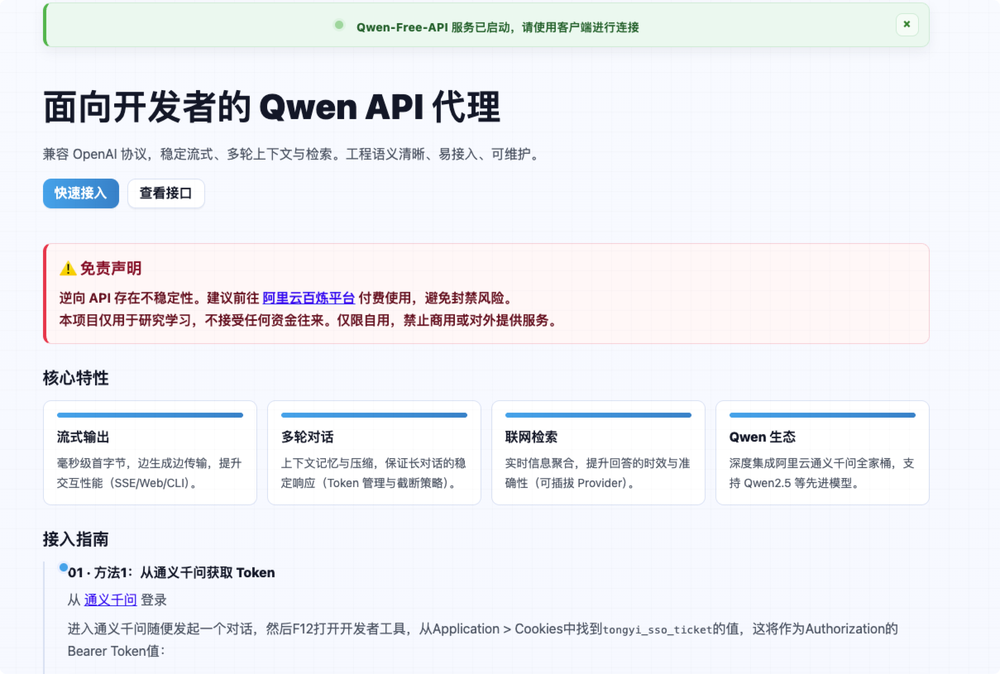
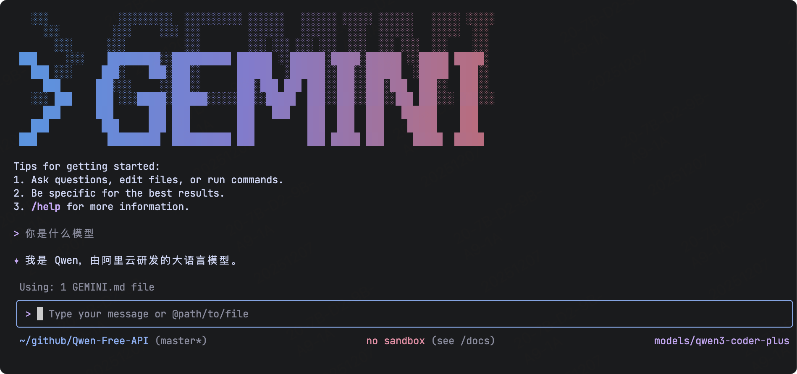
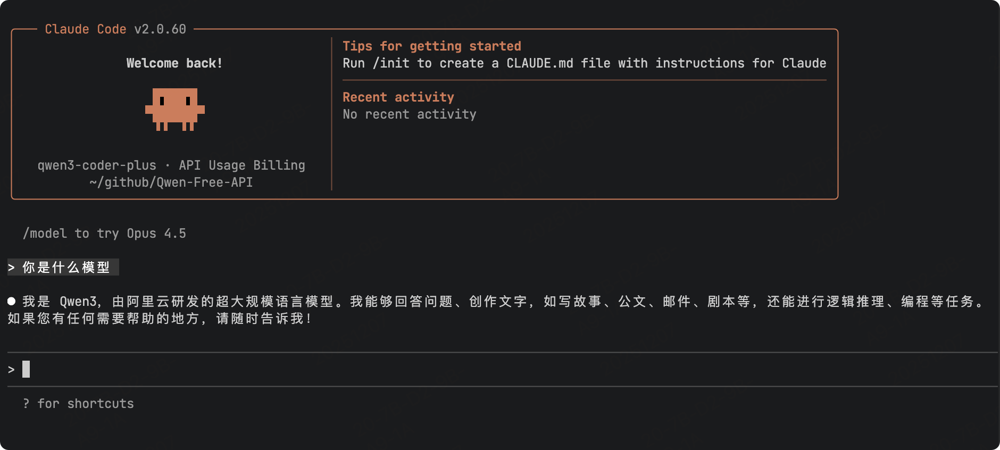

# Qwen AI Free Service

## Project Description

<span>[ <a href="README.md">中文</a> | English ]</span>

This project is modified from [https://github.com/LLM-Red-Team/qwen-free-api](https://github.com/LLM-Red-Team/qwen-free-api), thanks to the great contribution!
**Important**: The original project contains malicious code due to supply chain attacks. It is strongly recommended not to continue using it.

**Modifications:**
1. The original project's official interface modifications caused answer disorder, making the API basically unusable
2. The original project author rarely updates anymore
3. The malicious code included in the original project has been removed, and the source code of this project is welcome for review

## Update Notes

1. Modified `chat.ts` to fix non-streaming output interface methods, referring to the original project issue [返回的消息带错乱](https://github.com/LLM-Red-Team/qwen-free-api/issues/72)

2. Updated `models.ts` model list to support the latest models such as qwen3-235b-a22b, qwen3-coder-plus, qwen-plus-latest, etc.

3. Rebuilt the Docker image with the new version: `akashrajpuroh1t/qwen-free-api-fix:latest`

4. Fixed malicious code issues in the source code and rebuilt it. Verification as follows:

- The obfuscated code was included at the end of `src/api/chat.js` file, and after building, it appears in the container at `/app/dist/index.js` file around line 1871, as shown in the red box below:


- After fixing, the obfuscated code was removed, and after building, it appears in the container at `/app/dist/index.js` file around line 1951, as shown below:


**Models tested successfully:**


### Changelog

- **v1.0.1** (2025-12-07)

    - Refactored default homepage style and content, fixed partial descriptions
    - Added Gemini and Claude adapters

- **v1.0.0-fix** (2025-11-23)

    - Fixed malicious code issues in source code, resolved build-time errors

- **v0.0.23.2** (2025-11-09)

    - Fixed answer repetition issues: Optimized streaming response handling logic to only extract incremental content when text length increases, avoiding duplicate output

- **v0.0.23.1** (2025-08-12)

    - Fixed error: STRING_IS_BLANK-sessionId cannot be empty

- **v0.0.23** (2025-08-11)

    - After testing, the original interface's specified model ID was actually ineffective. Modified chat.ts related logic to support specified model IDs.
    - Updated models.ts list according to the official latest Chat-API interface [https://chat.qwen.ai/api/models](https://chat.qwen.ai/api/models)

## Disclaimer

**The reverse API is unstable. It is recommended to use the official Alibaba Cloud paid API at https://dashscope.console.aliyun.com/ to avoid the risk of being banned.**

**This organization and individual do not accept any financial donations or transactions. This project is purely for research, communication, and learning purposes!**

**For personal use only. It is forbidden to provide services to others or use for commercial purposes to avoid causing service pressure on the official service. Otherwise, you bear the risks yourself!**

**For personal use only. It is forbidden to provide services to others or use for commercial purposes to avoid causing service pressure on the official service. Otherwise, you bear the risks yourself!**

**For personal use only. It is forbidden to provide services to others or use for commercial purposes to avoid causing service pressure on the official service. Otherwise, you bear the risks yourself!**

## Effect Examples

### Service Default Homepage

After the service starts, the default homepage includes access guides and interface descriptions for quick access, eliminating the need to switch back and forth to find documentation.



### Gemini-cli Integration

This version added a Gemini-cli adapter, allowing direct API calls within Gemini-cli.



### Claude-code Integration

This version added a Claude-code adapter, allowing direct API calls within Claude-code.



### Identity Verification Demo


### Multi-turn Conversation Demo


### AI Drawing Demo


### Long Document Analysis Demo


### Image Analysis Demo


### 10-thread Concurrent Test


## Access Preparation

### Method 1

Login from [Tongyi Qianwen](https://tongyi.aliyun.com/qianwen)

Enter Tongyi Qianwen and start any conversation, then press F12 to open developer tools, find the value of `tongyi_sso_ticket` from Application > Cookies. This will be used as the Authorization Bearer Token value: `Authorization: Bearer TOKEN`


### Method 2

Login from [Alibaba Cloud](https://www.aliyun.com/) (not recommended if the account has important assets like servers). If the account has never entered [Tongyi Qianwen](https://tongyi.aliyun.com/qianwen) before, you need to first enter and agree to the protocol, otherwise it will not take effect.

Then press F12 to open developer tools, find the value of `login_aliyunid_ticket` from Application > Cookies. This will be used as the Authorization Bearer Token value: `Authorization: Bearer TOKEN`


### Multi-account Access

You can provide multiple account `tongyi_sso_ticket` or `login_aliyunid_ticket` separated by commas:

`Authorization: Bearer TOKEN1,TOKEN2,TOKEN3`

The service will select one from them for each request.

## Docker Deployment

Please prepare a server with a public IP address and open port 8000.

Pull the image and start the service

```shell
docker run -it -d --init --name qwen-free-api-fix -p 8000:8000 -e TZ=Asia/Shanghai akashrajpuroh1t/qwen-free-api-fix:latest
```

View real-time service logs

```shell
docker logs -f qwen-free-api-fix
```

Restart the service

```shell
docker restart qwen-free-api-fix
```

Stop the service

```shell
docker stop qwen-free-api-fix
```

### Docker-compose Deployment

```yaml
version: '3'

services:
  qwen-free-api:
    container_name: qwen-free-api-fix
    image: akashrajpuroh1t/qwen-free-api-fix:latest
    restart: always
    ports:
      - "8000:8000"
    environment:
      - TZ=Asia/Shanghai
```

### Local Dockerfile Build (Development)

Run in the project root:

```shell
./run-docker.sh

# Optional: override port/image name
HOST_PORT=8001 IMAGE_NAME=qwen-free-api:local ./run-docker.sh

# Disable auto-build (run only if image already exists)
AUTO_BUILD=0 IMAGE_NAME=your/image:tag ./run-docker.sh

# Optional: limit container memory
MEMORY_LIMIT=512m MEMORY_SWAP=512m ./run-docker.sh
```

### Other Deployment

Other deployment methods are not recommended as they have not been tested. It is recommended to use Docker deployment.

## API List

Currently supports OpenAI-compatible `/v1/chat/completions` interface. You can use it with OpenAI or other compatible clients, or use online services like [dify](https://dify.ai/) for integration.

### Chat Completions

The chat completions interface is compatible with OpenAI's [chat-completions-api](https://platform.openai.com/docs/guides/text-generation/chat-completions-api).

**POST /v1/chat/completions**

Headers need to set the Authorization header:

```
Authorization: Bearer [tongyi_sso_ticket/login_aliyunid_ticket]
```

Request data:
```json
{
    // Model name can be any value
    "model": "qwen",
    // Currently multi-turn conversation is implemented based on message merging, which may cause capability degradation in some scenarios and is limited by the maximum token count per turn
    // If you want to get the native multi-turn conversation experience, you can pass the id obtained from the previous round of messages to continue the context
    // "conversation_id": "bc9ef150d0e44794ab624df958292300-40811965812e4782bb87f1a9e4e2b2cd",
    "messages": [
        {
            "role": "user",
            "content": "Who are you?"
        }
    ],
    // If using SSE streaming, set to true, default is false
    "stream": false
}
```

Response data:
```json
{
    // If you want to get the native multi-turn conversation experience, this id can be passed to the next round of conversation's conversation_id to continue the context
    "id": "bc9ef150d0e44794ab624df958292300-40811965812e4782bb87f1a9e4e2b2cd",
    "model": "qwen",
    "object": "chat.completion",
    "choices": [
        {
            "index": 0,
            "message": {
                "role": "assistant",
                "content": "I am Qwen, a large-scale language model developed by Alibaba Cloud."
            },
            "finish_reason": "stop"
        }
    ],
    "usage": {
        "prompt_tokens": 1,
        "completion_tokens": 1,
        "total_tokens": 2
    },
    "created": 1710152062
}
```
